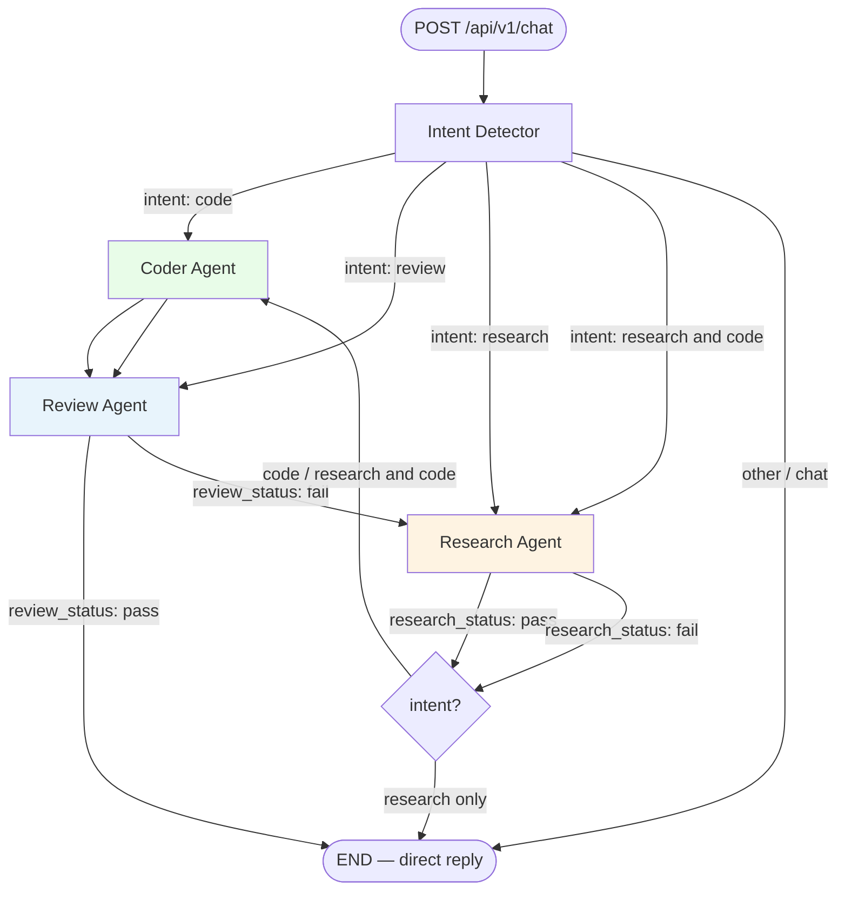

# Coding Agent

A multi-agent AI coding assistant built with **FastAPI**, **LangGraph**, and **AWS Bedrock**. It routes user requests through specialized agents (intent detection, code generation, PEP8 review, and web research), persists conversation state in **PostgreSQL**, and connects to external **MCP** servers for code formatting and DuckDuckGo search.

---

## What This Project Does

| Capability | Description |
|------------|-------------|
| **Intent routing** | Classifies each request as `code`, `review`, `research`, `research and code`, or a direct reply. |
| **Code generation** | Produces or revises Python code using an LLM (AWS Bedrock). |
| **Code review** | Validates generated code via a review agent that uses the **PEP8 MCP** toolbox (`format_code` and related tools). |
| **Research** | When review fails, the research agent uses **DuckDuckGo MCP** to gather context, then routes back to the coder. |
| **Stateful chats** | LangGraph checkpoints stored in PostgreSQL so threads can be resumed with `thread_id`. |
| **REST API** | Single chat endpoint: `POST /api/v1/chat`. |
| **Error logging** | Application errors are recorded in PostgreSQL via SQLAlchemy. |

---

## Architecture Overview

```text
Client
  │
  ▼
FastAPI (main.py, port 8005)
  │
  ▼
LangGraph workflow
  ├── Intent Detector  → routes by intent
  ├── Coder Agent      → generates / fixes code
  ├── Review Agent     → MCP PEP8 (port 8002)
  └── Research Agent   → MCP DuckDuckGo (port 8000)
  │
  ▼
PostgreSQL (LangGraph AsyncPostgresSaver + error logs)
```

**External services (must be running before chat requests that need them):**

| Service | Port | URL (default) | Used by |
|---------|------|---------------|---------|
| DuckDuckGo MCP | 8000 | `http://127.0.0.1:8000/mcp` | Research Agent |
| PEP8 MCP Toolbox | 8002 | `http://127.0.0.1:8002/mcp` | Review Agent |
| PostgreSQL | 5432 | — | Checkpoints + error DB |
| Main API | 8005 | `http://127.0.0.1:8005` | Client |

---

## Agent Flow Diagram

The graph entry point is **Intent Detector**. Edges depend on intent and agent outcomes (`pass` / `fail`).



**Loop behavior:** If review fails, research runs (DuckDuckGo MCP), then the coder may run again with review feedback, and review runs again until it passes or the graph ends.

---

## Prerequisites

- **Python 3.12+**
- **[uv](https://docs.astral.sh/uv/)** or **pip** for dependencies
- **PostgreSQL** (local or remote)
- **AWS credentials** with access to **Amazon Bedrock** (model configured in `.env`)
- **uv** (optional, for `uvx`) to run DuckDuckGo MCP without a separate install

---

## Project Structure

```text
Coding Agent/
├── main.py                 # FastAPI app entry (port 8005)
├── settings.py             # Loads .env configuration
├── pyproject.toml          # Main app dependencies
├── src/
│   ├── agent/              # Intent, Coder, Review, Research agents
│   ├── service/            # LangGraph build & invoke
│   ├── router/             # REST routes
│   ├── repository/         # PostgreSQL / SQLAlchemy
│   └── models/             # Pydantic & graph state
├── pep-8/
│   └── mcp_python_toolbox/ # PEP8 / format MCP server (port 8002)
└── Documentation/
    └── openapi.yaml        # API reference (paths may differ slightly from router)
```

---

## Setup

### 1. Clone and install the main application

```powershell
cd "d:\Agents\Coding Agent"
uv sync
```

Or with pip:

```powershell
python -m venv .venv
.\.venv\Scripts\Activate.ps1
pip install -e .
```

### 2. Configure environment variables

Create or edit `.env` in the project root:

```env
# Database
DB_HOST=localhost
DB_PORT=5432
DB_NAME=coding_agent
DB_USERNAME=postgres
DB_PASSWORD=your_password

# AWS Bedrock
AWS_REGION=us-east-1
AWS_ACCESS_KEY_ID=your_key
AWS_SECRET_ACCESS_KEY=your_secret
MODEL_ID=your_bedrock_model_id
MODEL_PROVIDER=amazon
MAX_TOKENS=2000
TEMPERATURE=0.7

# MCP servers (must match running ports)
MCP_SERVER_PEP8_URL=http://127.0.0.1:8002/mcp
MCP_DUCK_DUCK_GO_URL=http://127.0.0.1:8000/mcp

# App (optional — main.py uses port 8005 by default)
HOST=0.0.0.0
PORT=8080
```

Ensure the PostgreSQL database exists and is reachable. LangGraph creates checkpoint tables on first run via `checkpointer.setup()`.

### 3. Install the PEP8 MCP server (one-time)

```powershell
cd "d:\Agents\Coding Agent\pep-8\mcp_python_toolbox"
python -m venv .venv
.\.venv\Scripts\Activate.ps1
pip install -e .
```

---

## How to Run Everything

Use **four terminals** (or run MCP servers in the background). Start MCP servers and PostgreSQL **before** the main app when using review or research flows.

### Terminal 1 — PostgreSQL

Ensure PostgreSQL is running and the database in `.env` exists.

### Terminal 2 — DuckDuckGo MCP (port 8000)

```powershell
uvx duckduckgo-mcp-server --transport streamable-http --host 127.0.0.1 --port 8000
```

Alternative if already installed:

```powershell
duckduckgo-mcp-server --transport streamable-http --host 127.0.0.1 --port 8000
```

### Terminal 3 — PEP8 MCP (port 8002)

```powershell
cd "d:\Agents\Coding Agent\pep-8\mcp_python_toolbox"
.\.venv\Scripts\Activate.ps1
python -m mcp_python_toolbox --workspace "d:\Agents\Coding Agent"
```

The server listens at `http://127.0.0.1:8002/mcp` (streamable HTTP). The review agent uses the `format_code` tool from this server.

### Terminal 4 — Main Coding Agent API (port 8005)

```powershell
cd "d:\Agents\Coding Agent"
uv run .\main.py
```

Or:

```powershell
.\.venv\Scripts\Activate.ps1
python main.py
```

API base URL: **http://127.0.0.1:8005**  
Interactive docs: **http://127.0.0.1:8005/docs**

---

## Quick Start Checklist

1. [ ] PostgreSQL running, DB created, `.env` configured  
2. [ ] `uv sync` (or `pip install -e .`) in project root  
3. [ ] PEP8 MCP installed under `pep-8/mcp_python_toolbox`  
4. [ ] DuckDuckGo MCP on port **8000**  
5. [ ] PEP8 MCP on port **8002**  
6. [ ] Main app: `uv run .\main.py` on port **8005**

---

## API Usage

**Endpoint:** `POST /api/v1/chat`

**Request body:**

```json
{
  "message": "Write a Python function to merge two sorted lists",
  "thread_id": null
}
```

- Omit `thread_id` or send `null` for a new conversation (server generates one).  
- Reuse the same `thread_id` to continue a thread (checkpoints in PostgreSQL).

**Example (PowerShell):**

```powershell
Invoke-RestMethod -Method Post -Uri "http://127.0.0.1:8005/api/v1/chat" `
  -ContentType "application/json" `
  -Body '{"message":"Review this code: def add(a,b): return a+b"}'
```

**Response fields (in `message`):** may include `updated_code`, `review_content`, `research_content`, or `reply` depending on the path taken.

---

## Supported Intents

| Intent | Flow |
|--------|------|
| `code` | Coder → Review → (Research if fail) → Coder loop |
| `review` | Review only (user message treated as code) |
| `research` | Research → END |
| `research and code` | Research → Coder → Review → … |
| Other | Direct LLM reply, END |

---

## Technology Stack

- **FastAPI** + **Uvicorn** — HTTP API  
- **LangGraph** — multi-agent workflow and routing  
- **LangChain** + **langchain-aws** — Bedrock LLM and agents  
- **langchain-mcp-adapters** — MCP tool clients (streamable HTTP)  
- **SQLAlchemy** + **PostgreSQL** — errors and checkpoints  
- **mcp_python_toolbox** — PEP8/format/lint MCP (bundled under `pep-8/`)  
- **duckduckgo-mcp-server** — web search MCP (external, via `uvx`)

---

## Troubleshooting

| Issue | What to check |
|-------|----------------|
| MCP client creation error | DuckDuckGo (8000) and/or PEP8 (8002) not running; wrong URL in `.env` |
| Database / checkpoint errors | PostgreSQL up, credentials in `.env`, database exists |
| Bedrock errors | `MODEL_ID`, region, and AWS keys in `.env` |
| Review agent has no tools | PEP8 server running; tool name `format_code` must be available |

---


